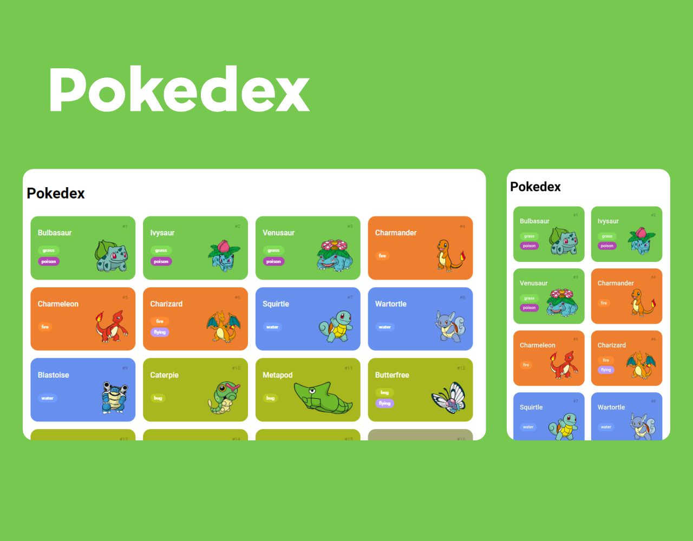

<h1 align="center"> Pokedex </h1>

Projeto desenvolvido durante o Bootcamp Potência Tech Angular Developer - Powered by iFood  

  <a href="#-tecnologias">Tecnologias</a>&nbsp;&nbsp;&nbsp;|&nbsp;&nbsp;&nbsp;
  <a href="#-projeto">Projeto</a>&nbsp;&nbsp;&nbsp;|&nbsp;&nbsp;&nbsp;
  <a href="#-layout">Layout</a>&nbsp;&nbsp;&nbsp;|&nbsp;&nbsp;&nbsp;
  <a href="#-api">API</a>

  

 

  

## 🚀 Tecnologias

Esse projeto foi desenvolvido com as seguintes tecnologias:

- HTML e CSS
- JavaScript
- Git e Github

## 💻 Projeto

A Pokedex é um app que mostra todos os Pokemons da 1ª geração, mas que pode se expandir de acordo com a necessidade.

- [Visite o projeto online](https://italoopaula.github.io/Pokedex/)

## 🔖 Layout

Você pode visualizar o layout do projeto através [DESSE LINK](https://dribbble.com/shots/6540871-Pokedex-App). A intenção não era reproduzir fielmente o layout original, mas sim usá-lo como inspiração.

## 📃 API

- [Confira a API utilizada](https://pokeapi.co/)

---